## Table of Contents

Detailed Overview and Feedback Admin and User Pages (incl comparison)

```text
1. LANDING PAGE............................................................................................2
```

```text
1.1. Current view.................................................................................................... 2
1.2 Earlier view...................................................................................................... 2
1.3 Proposed Admin View....................................................................................... 3
1.4 Proposed User View.......................................................................................... 3
```

```text
2. (CIRCULAR) UNIFORM TRACKER...................................................................5
2.1 LANDING PAGE................................................................................................. 5
2.1.1 Current Admin and User View.........................................................................................5
2.1.2 Proposed Admin and User View......................................................................................6
2.2 UNIFORM OVERVIEW........................................................................................ 7
2.2.1 Current View......................................................................................................................7
2.2.2 Proposed Admin View.....................................................................................................8
2.2.3 Proposed User View......................................................................................................10
2.3 INVENTORY OVERVIEW................................................................................... 13
2.3.1 Current View.................................................................................................................13
2.3.2 Proposed Admin View....................................................................................................14
2.3.4 Proposed User View...........................................................................................................16
2.4 INVENTORY BY ITEMS..................................................................................... 19
2.4.1 Current View.................................................................................................................19
2.4.2 Proposed Admin View Landing Page.............................................................................20
2.4.3 User View.....................................................................................................................22
2.4.4 Current view Subpage Inventory by Item.......................................................................25
2.4.5 Proposed Admin and User View Subpage inventory by Item...........................................27
2.5 UPDATE INVENTORY....................................................................................... 30
2.5.1 Current Admin and User View Landing Page Update Inventory.......................................30
2.5.2 Proposed Admin and User View Landing Page Update Inventory....................................31
2.5.3 Current Admin and User View Pop up window: +Add New Pieces..................................33
2.5.4 Proposed Admin View Pop up Window: +Add New Pieces.............................................35
2.5.5 Proposed User View Pop up Window: +Add New Pieces...............................................38
2.5.6 Current Admin and User View Pop up Window: +Update Item Status............................39
2.5.7 Proposed Admin and User View Pop Up Window: +Update Item Status.........................40
2.5.8 Current Admin and User View Update Inventory Status (final page)..............................41
2.5.9 Proposed Admin and User View Update Inventory Status (final page).............................42
```

1

```text
3. DONATION DRIVES...................................................................................... 44
```

```text
3.1 Current Admin and User View Donation Drives....................................................................44
3.2 Proposed Admin View Donation Drives........................................................................45
3.3 Proposed User View Donation Drives...........................................................................48
```

---

2

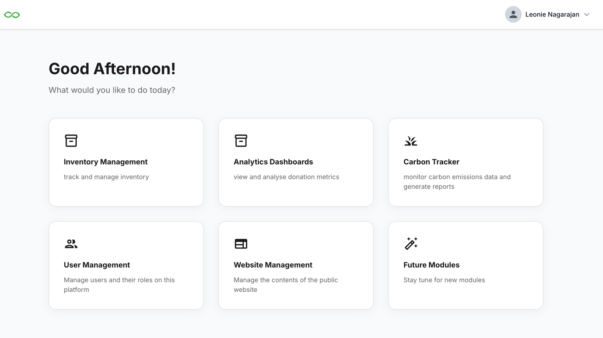

## 1.LANDING PAGE 1.1. Current view 1.2 Earlier view

### Comment:

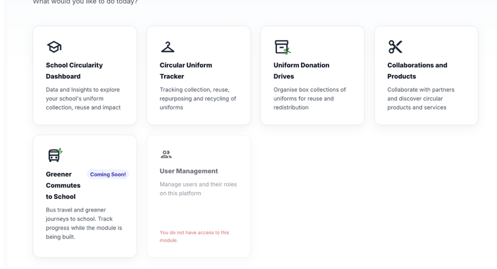

The earlier version already incorporated our feedback, now it is back to the first version. Can it be adjusted like this for both the Admin and User view? It would look like this:

---

3

## 1.3 Proposed Admin View

Good Morning/Evening!


Welcome to UTrack, a platform that helps schools and Parent Support Groups manage preloved school uniforms more effectively. Track donations, monitor reuse and repurposing activities, measure environmental and social impact, and generate

insights to support more sustainable school communities.

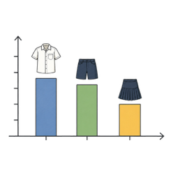

Together, we can extend the life of school uniforms, reduce textile waste, and make

circularity visible, measurable and actionable. What would you like to do today?

School Uniform Tracker Donation Drives Collaborations


### Dashboard

Data and insights to reuse, repurposing materials to organise Overview of explore your school’ s and recycling of school and manage donation sustainability projects

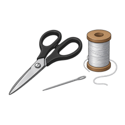

> uniform collection,
> reuse and impact

### Tracking collection, Resources and info

> uniforms drives and products made of


### and Products

### repurposed uniforms


Greener Routes User Website Future Modules

to School Management Management

Supporting more Manage users and Managing the content Stay tuned for new sustainable journeys their roles on this of the public website modules


### to and from school website

## 1.4 Proposed User View


Good Morning/Evening!

Welcome to UTrack, a platform that helps schools and Parent Support Groups manage preloved school uniforms more effectively. Track donations, monitor reuse and repurposing activities, measure environmental and social impact, and generate

insights to support more sustainable school communities.

---

4

Together, we can extend the life of school uniforms, reduce textile waste, and make circularity visible, measurable and actionable. What would you like to do today?

School Uniform Tracker Donation Drives Collaborations Dashboard

Data and insights to reuse, repurposing materials to organise Overview of explore your school’ s and recycling of school and manage donation sustainability projects uniform collection, reuse and impact

### Tracking collection, Resources and info

> uniforms drives and products made of

### and Products

### repurposed uniforms

### Comments:

•As thewording isa bitlong, shorten to School Dashboard, Uniform Tracker, Donation Drives, Collaborations & Products

```text
•Graphic icons were uploaded earlier here:
https://drive.google.com/drive/folders/14LKZPOQYsxtlkb CBEQz-
g FTSyh 9Qv LBH? usp=drive_link
```

---

5

2. (CIRCULAR) UNIFORM TRACKER

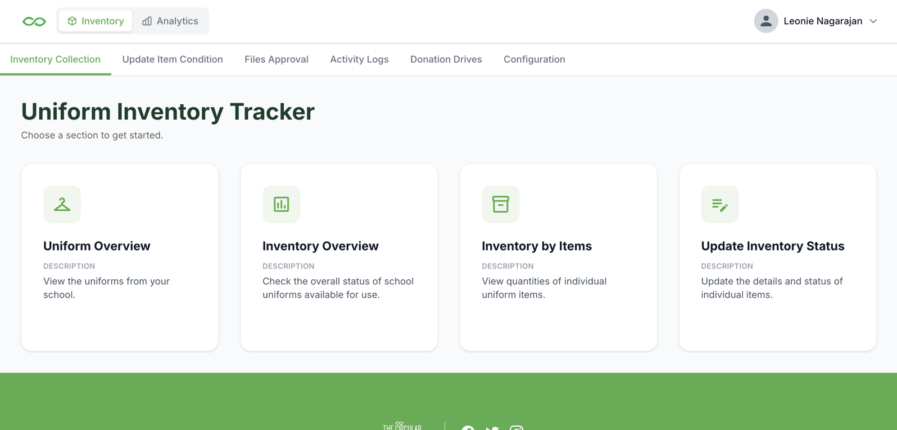

## 2.1 LANDING PAGE

### 2.1.1 Current Admin and User View

---

6

### 2.1.2 Proposed Admin and User View


### School Dashboard Uniform Tracker Donation Drives Collaborations &


### Products Leonie Nagarajan

Uniform Tracker Trackthecollection, reuse, repurposing and recycling of school uniforms


Uniform Overview Inventory Overview Inventory by Items Update Inventory


View the uniforms from your school Check the overall status of uniforms View quantities of individual uniform Update the details and status of

### for use items individual items


Comments: •The menu bar needs to be updated •Onemain header (Update Inventory) andexplanatory notes for all headersneed to be updated •Remove the word “Description: from thecurrentboxes •Graphic icons were uploaded earlier here: https://drive.google.com/drive/folders/14LKZPOQYsxtlkb CBEQz-g FTSyh 9Qv LBH? usp=drive_link •This section page will look the same for Admin and regular User

---

7

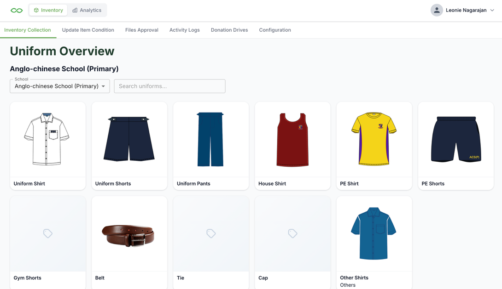

## 2.2 UNIFORM OVERVIEW

```text
2.2.1 Current View
Admin View
```

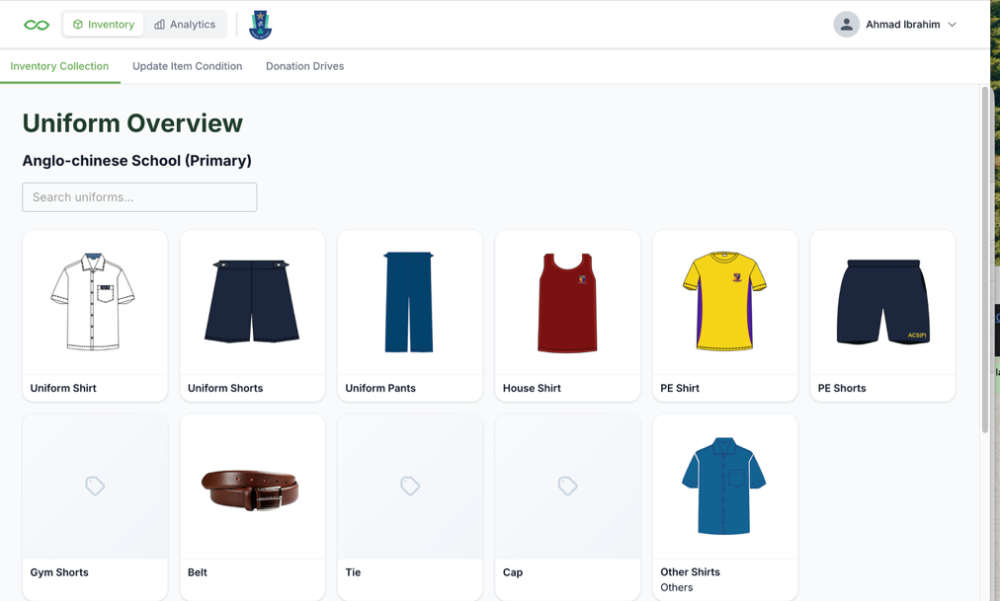

### User View

---

8

### 2.2.2 Proposed Admin View

### School Dashboard Uniform Tracker Donation Drives Collaborations &


### Products Leonie Nagarajan

### Uniform Overview

> Inventory Overview Inventory by Items Update Inventory Files Approval Activity Logs Configuration

### Uniform Overview


### View the uniforms from your school

### Anglo Chinese School (Primary)

School Search Uniforms Dropdown menu (showingthe 10 pilot schoolsplus ALL)

---

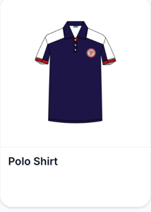

9

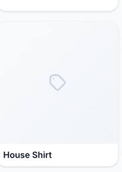

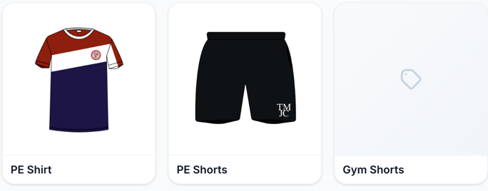


### Tie Belt Cap Others


---

10

### 2.2.3 Proposed User View

### School Dashboard Uniform Tracker Donation Drives Collaborations &

### Products Staff XYZ

### Uniform Overview Inventory Overview Inventory by Items Update Inventory

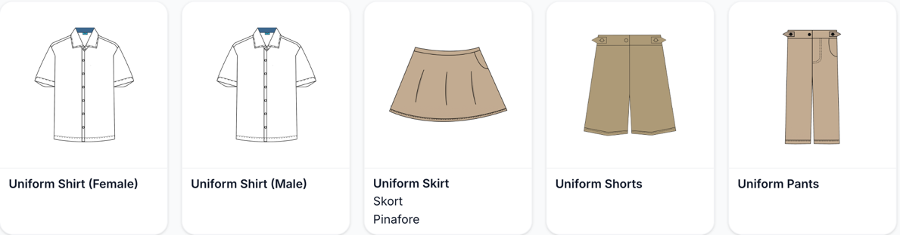

### Status

### Uniform Overview

### View the uniforms from your school

### Anglo Chinese School (Primary)

---

11

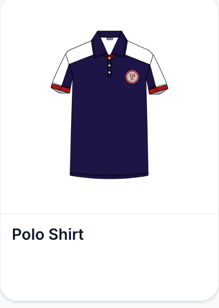

### Tie Belt Cap Others

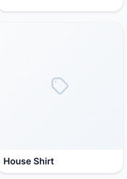

Comments: •Majority of elements are the same for both Admin and User view •The navigation/menubar has to beclear andupdated for both Admin and User view; it is mostly the same but the Admin view includes Files Approval, Activity Log, Configuration)


•Of course, the User will only see her/his school. The first school the Admin follows the alphabet order (in this case ACS). •Then, the Admin has to use the search function to select a specific school.

---

12

•The search function is only needed for the Admin view, not the User view. A user will not search among 10 uniform types of her/his own school. However, as an Admin, it is useful to see shirt designs of one school and across all schools. Hence, next to listing the pilot schools, we would need the option of “All Schools”)

•Layout/order has to be changed for both views (uniform items in different rows; there are 4 “categories”: 1) formal uniform pieces (shirts f/m, skirt/pinafore/skorts, shorts, pants); 2) Polo and house shirts; 3) PE shirts and shorts, 4) the “rest” (tie, belt, cap, others); removethe category “Other Shirts” and “Gym Shorts” •If a uniform item isnot available for that school, the icon should not appear. •The school logo should appear before the name of the school, not on the topmenu bar •Centrethe words (type of uniform) below the graphics •Graphics for the missing uniform types (Tie, Belt, Cap, Others) are uploaded here: https://drive.google.com/drive/folders/1f Z-e FISc VSJFPn JBn HPh F46 Cwy O6w ULr? usp=drive_link

---

13

## 2.3 INVENTORY OVERVIEW

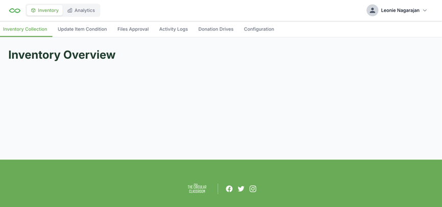

### 2.3.1 Current View

### Admin View

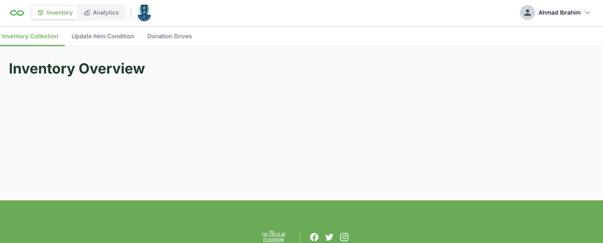

### User View

Comments: The pages are currently not loading.

---

14

### 2.3.2 Proposed Admin View

### School Dashboard Uniform Tracker Donation Drives Collaborations &

### Products Leonie Nagarajan

### Uniform Overview

> Inventory Overview Inventory by Items Update Inventory Files Approval Activity Logs Configuration

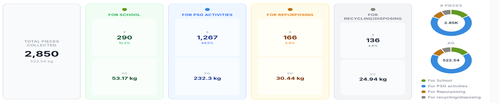

### Inventory Overview

### Check the overall status of uniforms for use

```text
School
Dropdown menu (showingthe 10 pilot schools plus ALL)
```

### Anglo Chinese School (Primary)

### Current Inventory as of (Date of today)

---

15

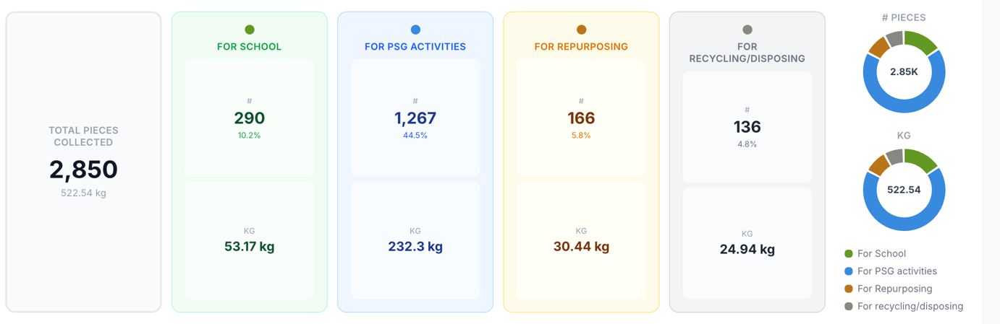

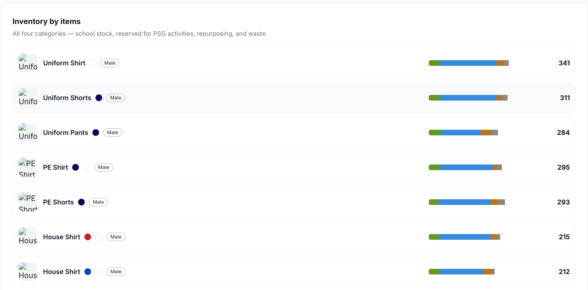

Inventory by Items Bycategories For School, For PSG Activitiesand For Repurposing

---

16

### 2.3.4 Proposed User View

### School Dashboard Uniform Tracker Donation Drives Collaborations &

### Products Leonie Nagarajan

### Uniform Overview Inventory Overview Inventory by Items Update Inventory

### Inventory Overview

### Check the overall status of uniforms for use

### Anglo Chinese School (Primary)

### Current Inventory as of (Date of today)

---

17

Inventory by Items Bycategories For Schooland For PSG Activities

### Comments:

•The School Dashboard has one section about the current inventoryand refers to this data. It can be replicated there. •This pageshows thecurrent inventory in terms of what is available NOWwhich is the accumulated number of all donations drives minus the transactions.

---

18

•This number is NOT the same asthe number of uniforms collected in this year andalso NOT the same asthe number of

overall uniforms collected by that school. •The Admin and User view are almost the same except:

§The Admin view has a dropdown list to select either “All schools” to see the inventory across all schools or a particular §The Admin view shows three categories (For School, For PSG Activities, For Repurposing) §The User view shows only the two school relevant categories

### school (the pilot schools)

•We do not show the uniforms that went to recycling/disposal here. They do not count as inventory anymore, as they are

gone. •The bar charts have to be updated accordingly.

```text
•We do not list percentages here. Percentages are only relevant when we look at all categories, including disposal.
•Ensure that the items are listed in the confirmed order (Shirt, Skirt/Pinafore, Shorts, Pants, Polo Shirt, House Shirt, PE Shirt,
•Graphics are not yet loading and some are missing. They are uploaded in the respective school folders here:
https://drive.google.com/drive/folders/1t Jvri 9QBJXTs FEy Up Xl VCrts GUAS 3Ky? usp=drive_link
```

### PE Shorts, Belt, Tie, Cap, Others)

---

19


## 2.4 INVENTORY BY ITEMS

### 2.4.1 Current View

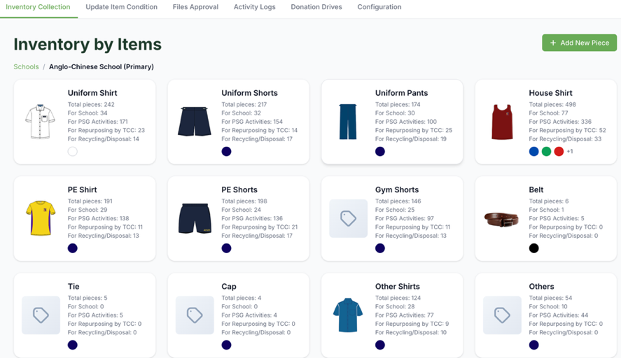

### Admin View

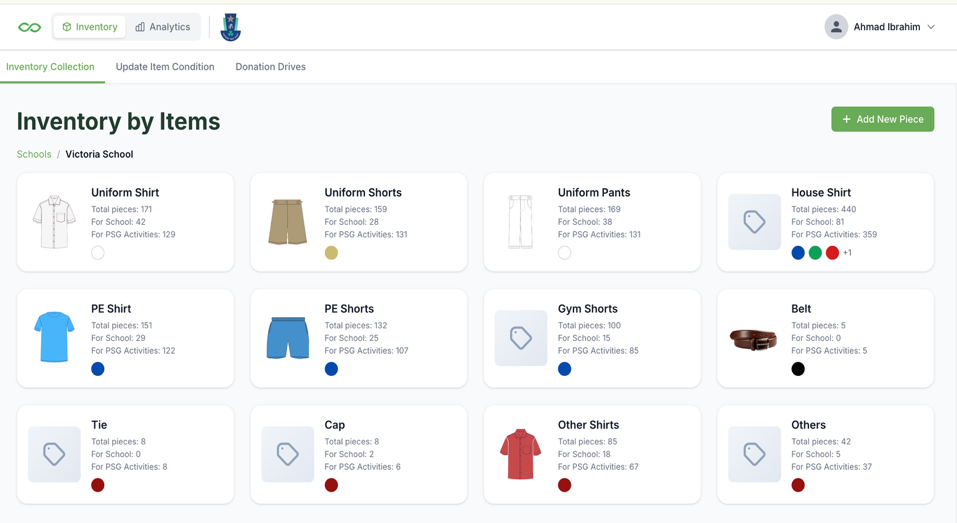

### User View

---

20

### 2.4.2 Proposed Admin View Landing Page

### School Dashboard Uniform Tracker Donation Drives Collaborations &

### Products Leonie Nagarajan

### Uniform

Overview Inventory Overview Inventory by Items Update Inventory Files Approval Activity Logs

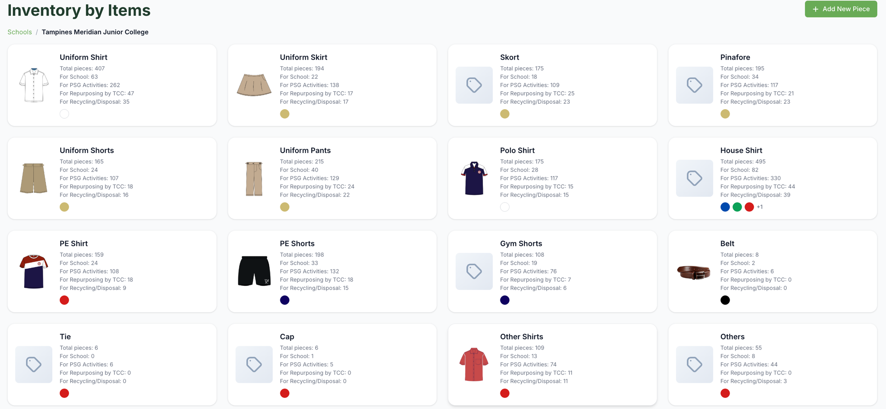

### Configuration

### Inventory by Items

View quantities of individual uniform items School Dropdown menu (showingthe 10 pilot schools plus ALL)

### Anglo Chinese School (Primary)

Current Inventory as of (Date of today) Click on an item to find out more. Note: The display of sizes is optional.

---

21


### BELT


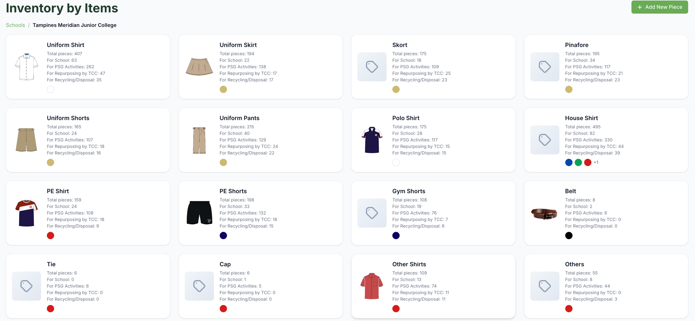

### OTHERS

---

22

### 2.4.3 User View

### School Dashboard Uniform Tracker Donation Drives Collaborations &

### Products Leonie Nagarajan

### Uniform Overview Inventory Overview Inventory by Items Update Inventory


### Inventory by Items

### View quantities of individual uniform items

### Anglo Chinese School (Primary)

Current Inventory as of (Date of today) Click on an item to find out more. Note: The display of sizes is optional.

---

23

### BELT

### OTHERS

### Comments:

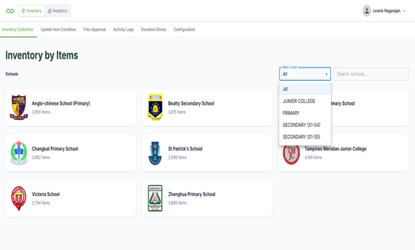

•Tosimplify this section, we suggest to remove the “interim” page under Admin View. We canfollow the same style as for the Uniform Overview page (add dropdown list for schools). For now, we only have 10 schools and do not need the additional filter of Primary, Secondary, etc. To be discussed if it is useful to keep it running in the backend.

•The view ismore or less the same, butthe Admin view always includes the additional features Files Approval, Activity Log, Configuration

•Spelling error: Add New Pieces (not Piece), however, we will remove this here. It makes more sense to park it under Update Inventory •Follow the samelist and order ofuniforms as forthe Uniform Overview

---

24

•For the Admin view, we show Total Pieces, For Schools, For PSG Activities, For Repurposing. We remove For Recycling/Disposalas these uniforms are gone. •For the User view, we only show Total Pieces, For Schools and For PSG Activities

---

25

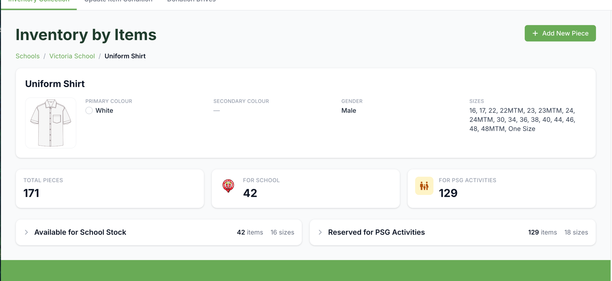

### 2.4.4 Current view Subpage Inventory by Item

---

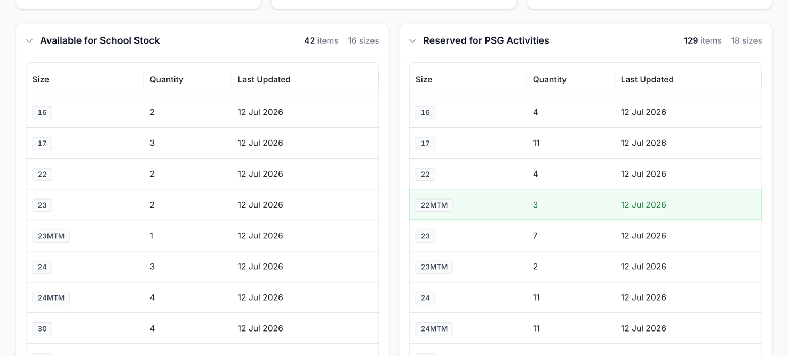

26

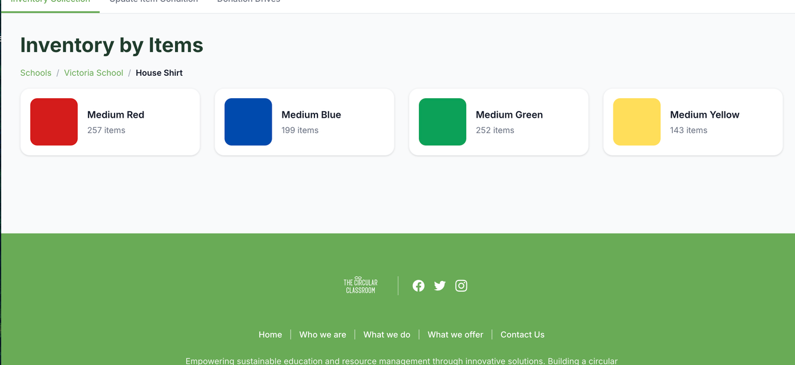

---

27

### 2.4.5 Proposed Admin and User View Subpage inventory by Item

### School Dashboard Uniform Tracker Donation Drives Collaborations &


### Products Leonie Nagarajan

Uniform Overview Inventory Overview Inventory by Items Update Inventory Files Approval Activity Logs Configuration

### Inventory by Items

### View quantities of individual uniform items


```text
School
Dropdown menu (showing the 10 pilot schools plus ALL)
```

### Anglo Chinese School (Primary)

Current Inventory as of (Date of today) Note: The display of sizes is optional.

---

28


Comments: •Admin and User view are almost the same. Here are the differences:


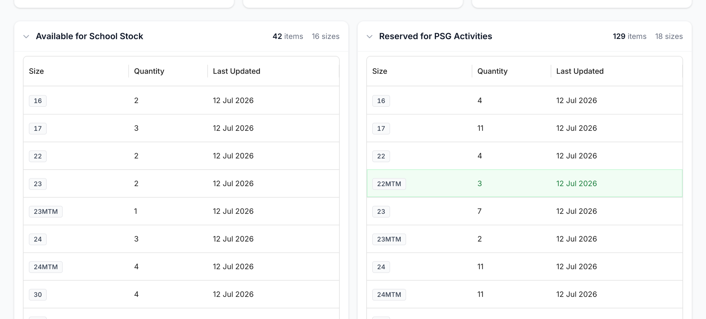

o Admin view has theadditional menu items (Files Approval, Activity Logs, Configuration) o Admin view has a dropdown menu to select schools

---

29

•Can the PSG icon be replaced with thisgraphic? Uploaded here: https://drive.google.com/file/d/10FCGes Yi WNOaiv Pwr-
w L__Pdci BCM 7Q9/view? usp=drive_link

```text
•If an item has more than one colourstyles (mainly house shirts), it should state Multicolour in the Primary Colour section;
see colour codes of 10 schools: https://docs.google.com/spreadsheets/d/1FUFg 6q Es AX8 Aoc V-
2q KBu FTNdh Vda 69/edit? gid=847491753#gid=847491753; in this case, the bar with the various colours appears below the
uniform item
```


•Important: the colour codes displayed for the Admin and User viewshould not bethe same. For the User view, wewanted to keep it simple: blue, red, yellow, etc. For the Admin view, we suggestedsome nuances: light blue, medium blue, etc. If this is too complicated, werecommend using the same colour code for both Admin and User.

•Remove the “+Add New Items” section; as this will be added to the “Update Inventory Section”, next to the option “Update Item Status”

---

30

## 2.5 UPDATE INVENTORY

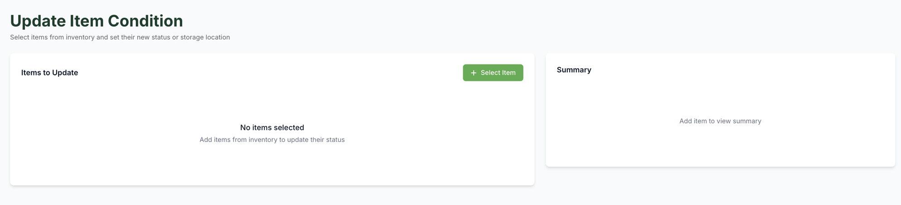

### 2.5.1 Current Admin and User View Landing Page Update Inventory

---

31

2.5.2 Proposed Admin and User View Landing Page Update Inventory

### School Dashboard Uniform Tracker Donation Drives Collaborations &

### Products Leonie Nagarajan


Uniform Overview Inventory Overview Inventory by Items Update Inventory Files Approval Activity Logs Configuration

### Update Inventory

### Update the details and status of individual items

School Dropdown menu (showing the 10 pilot schools plus ALL)


### Anglo Chinese School (Primary)

### Update Item Status

### Summary

### Summary

---

32

### Comment:

•This sectionwas earlier mainlymeantfor changing the status and storage location of items. However, it makes more sense to use this section for both o Updating the details (i.e. adding new piecesof one item) AND o Updating the status of individual items.

•Admin and User view are the same, but the Admin view includes the additional elements markedin turquoise •Correction: Add New Pieces, not Piece •We need to give schools the option to fill out the Donation File template with either basicorcomprehensive information. This means that Usersmustfill out the number of a uniform item, but it would be optionalto complete the size details. If the User does not want to key in thesize details, it should belistedin the template and the inventory platformas “No Sizegiven”. •What does the summarysection include?

---

33

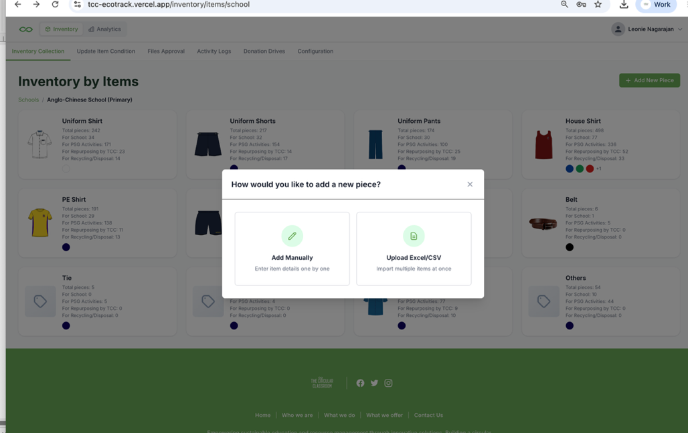

2.5.3 Current Admin and User View Pop up window: +Add New Pieces

### Admin View

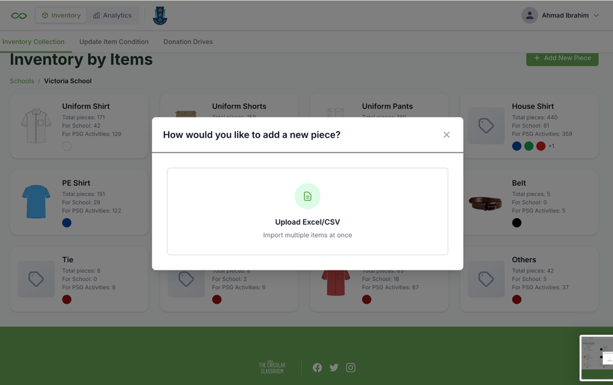

### User View

---

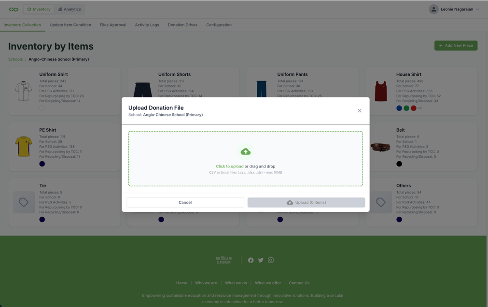

34

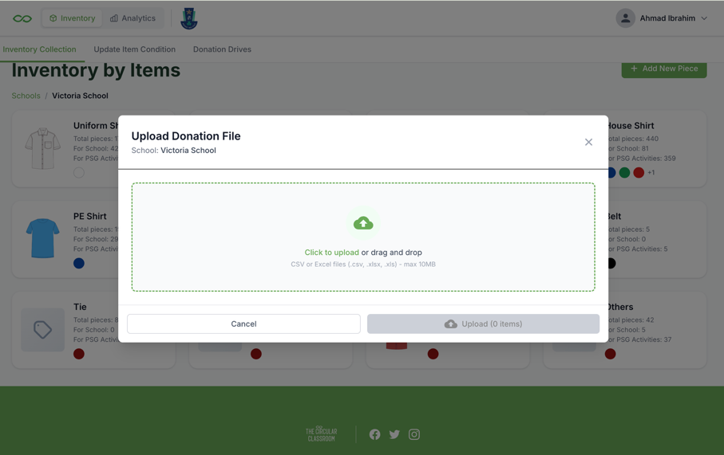

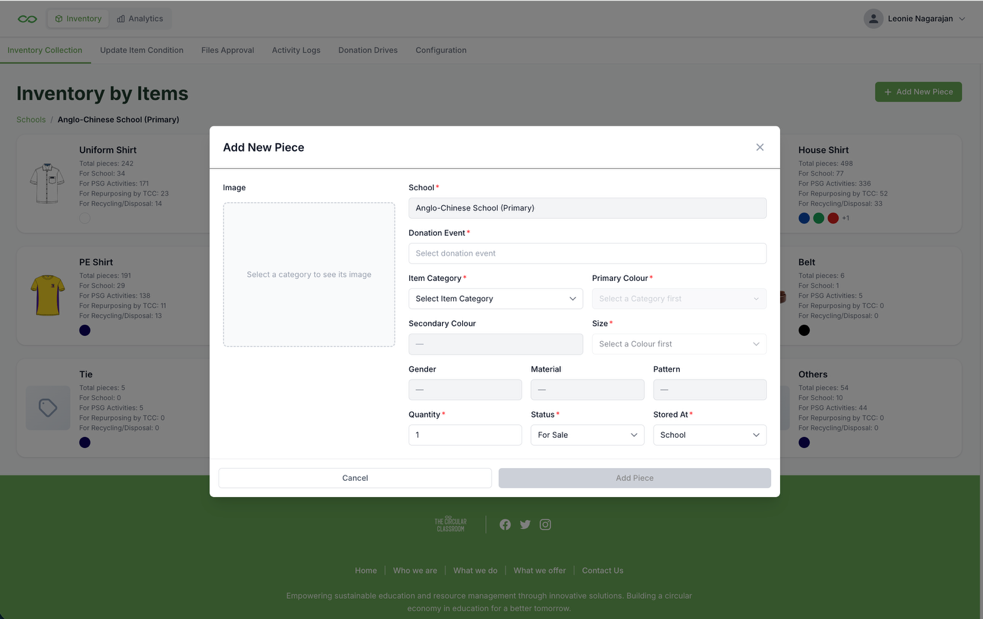

---

35

### 2.5.4 Proposed Admin View Pop up Window: +Add New Pieces

### School Dashboard Uniform Tracker Donation Drives Collaborations &


### Products Leonie Nagarajan

Uniform Overview Inventory Overview Inventory by Items Update Inventory Files Approval Activity Logs Configuration


### Update Inventory

Update the details and status of individual items School Dropdown menu (showing the 10 pilot schools plus ALL

### +Update Item Status

---

36

### Comments:

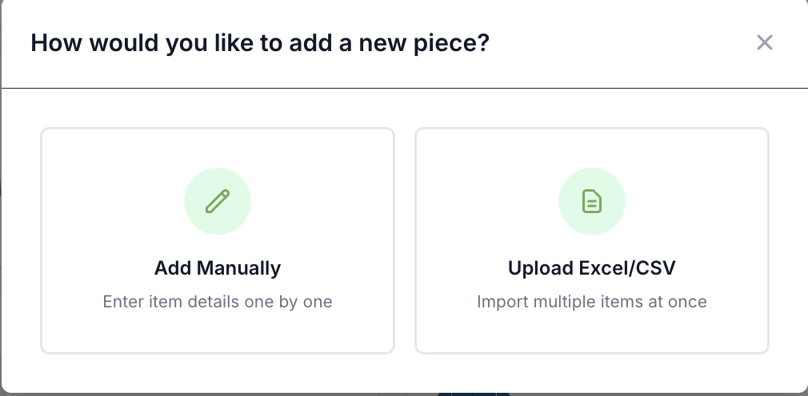

•Pop up window finebut at can it also include the template for the uniform donation for download? •Please change: How would you like to add new pieces?

---

37

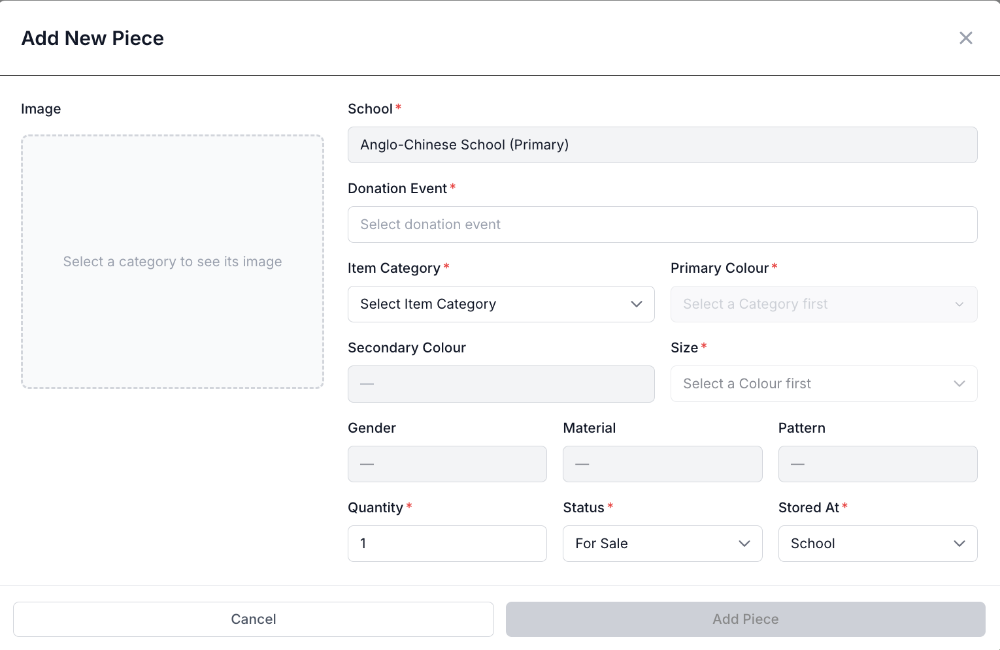

Comments: •Pop up window fine. •Please change: Add New Pieces •There is a technical bug. We cannot select the item category so that a window pops up.

---

38

### 2.5.5 Proposed User View Pop up Window: +Add New Pieces

### School Dashboard Uniform Tracker Donation Drives Collaborations &


### Products Staff Member

### Uniform Overview Inventory Overview Inventory by Items Update Inventory


> Update Inventory
> Update the details and status of individual items

### Anglo Chinese School (Primary)

### +Update Item Status

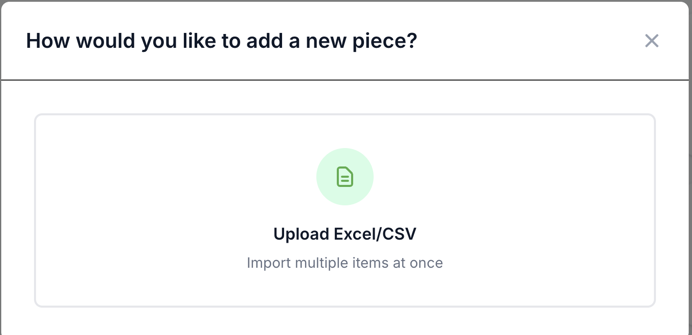

### Comments:

•Same as for Admin View. The popup windowisfine but it also includesthe template for the uniform donation for download? •Please change: Add new pieces by uploadingthe Uniform Donation template 2.5.6 Current Admin and User View Pop up Window: +Update Item Status

39

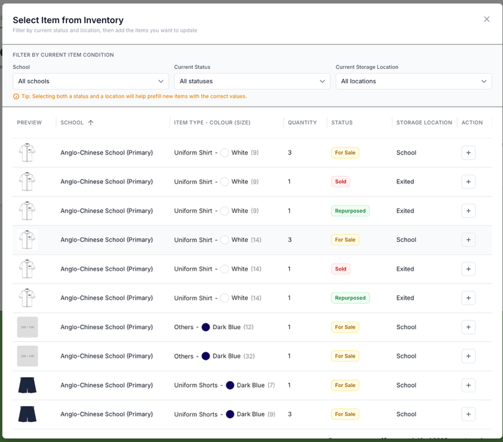

### Admin View

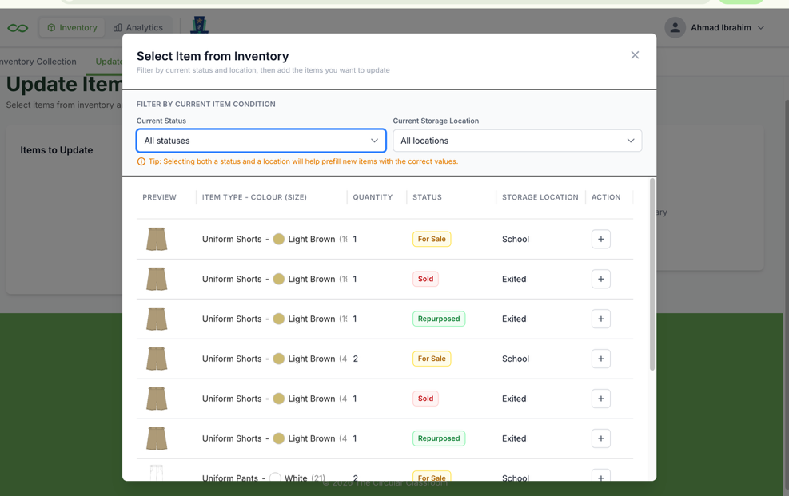

### User View

---

40

2.5.7 Proposed Adminand User View Pop Up Window: +Update Item Status

### School Dashboard Uniform Tracker Donation Drives Collaborations &

### Products Leonie Nagarajan


### Uniform Overview Inventory Overview Inventory by Items Update Inventory

### Update Inventory

### Update the details and status of individual items


```text
School
Dropdown menu (showing the 10 pilot schools plus ALL
```

### Anglo Chinese School (Primary)

### +Update Item Status

Comments: •No changes for thepopupwindows. •Admin view has additional menu points (File Approval, Configuration, etc).and the School Dropdown menue •For all the menu items, can they “light up” in green when you move with the curser on it or somehow remain highlighted for better navigation/orientation when the user is visiting that section 2.5.8 Current Admin and User View Update Inventory Status (final page)

41

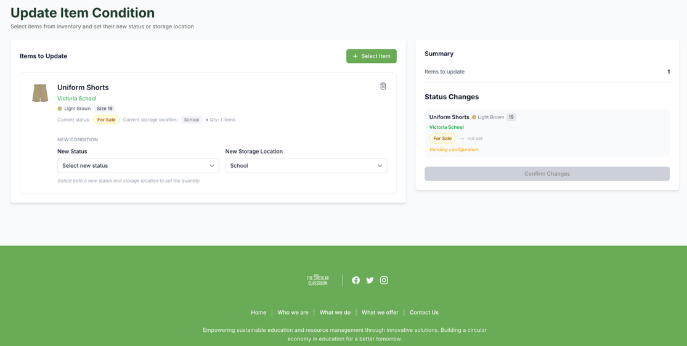

### Admin View

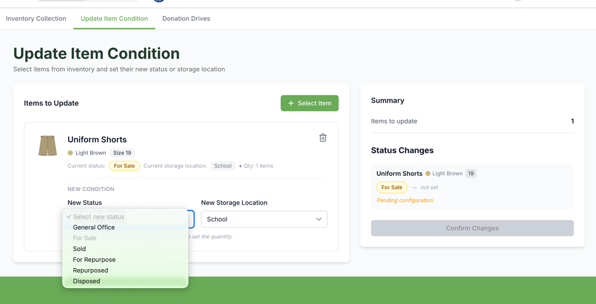

### User View

---

42

2.5.9 Proposed Admin and User View Update Inventory Status (final page)

### School Dashboard Uniform Tracker Donation Drives Collaborations &

### Products Leonie Nagarajan


### Uniform Overview Inventory Overview Inventory by Items Update Inventory

### Update Inventory

Update the details and status of individual items School Dropdown menu (showing the 10 pilot schools plus ALL Anglo Chinese School (Primary)

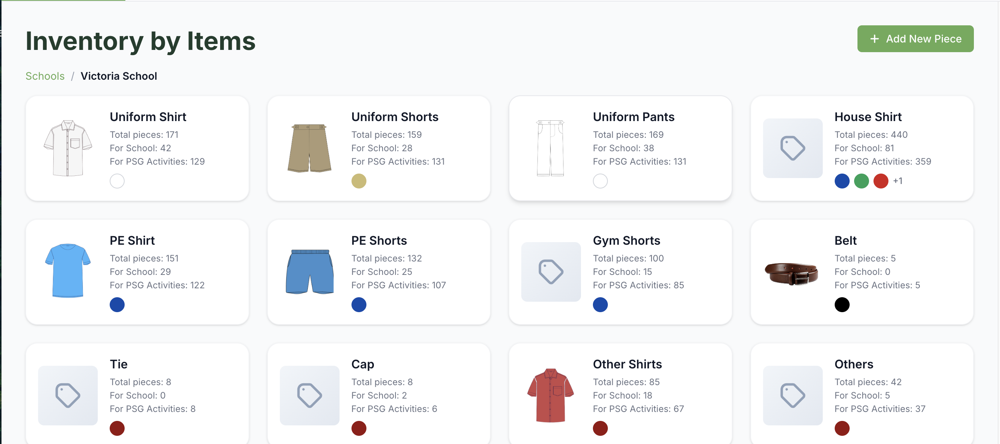

### +Update Item Status

### Comment:

•Same view except the admin view has the usual menu items (File Approval, Configuration, etc.) AND another line with the

school category •What is supposed to be under Summary? •There is a bug when you click on Confirm. See below

---

43

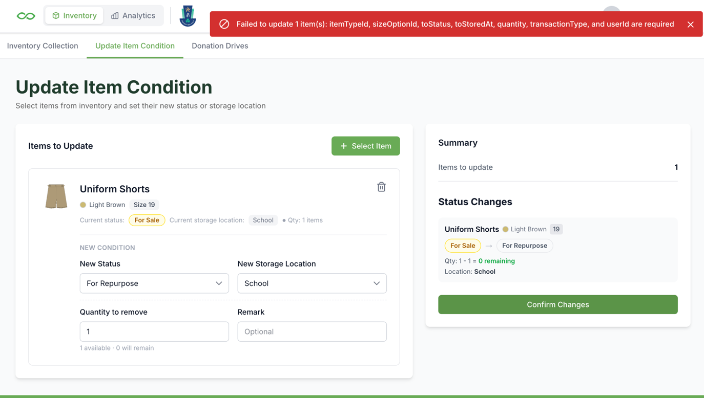

---

44

# 3.DONATION DRIVES

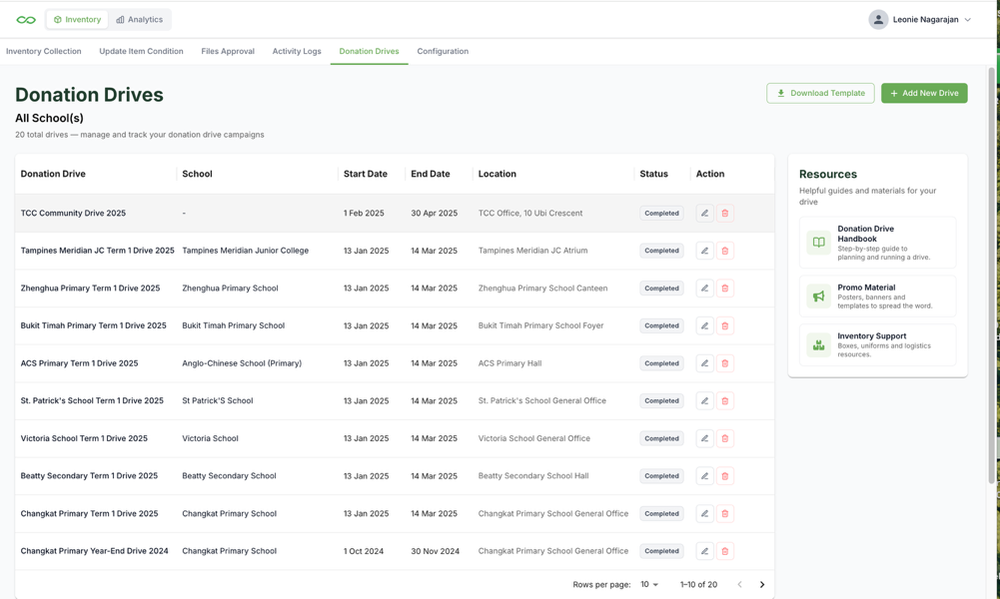

### 3.1 Current Admin and User View Donation Drives

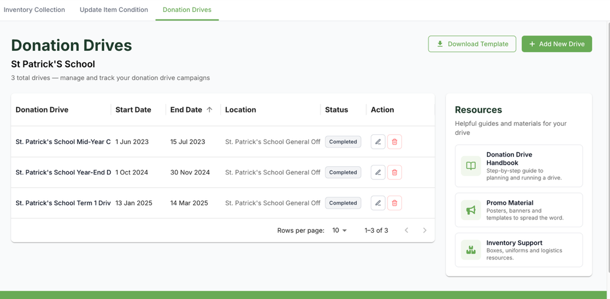

### Admin View

### User View

---

45


### 3.2 Proposed Admin View Donation Drives


> School Dashboard Uniform Tracker Donation Drives Collaborations & Products Leonie Nagarajan

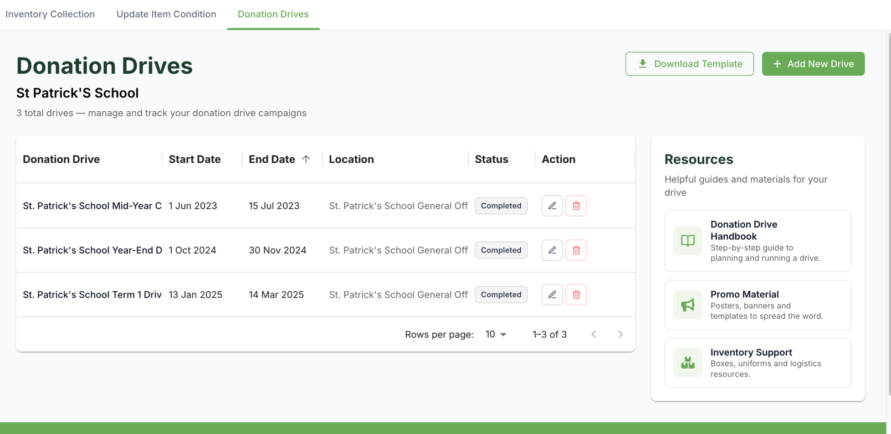

### Donation Drives


Resources and info materials to organise and manage donation drives School Dropdown menu

---

46

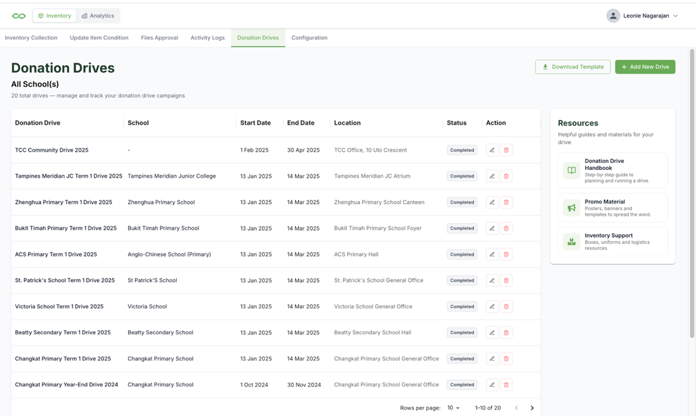

Comment: •It is good to keep the “chronological overview” of ongoing uniform drives. •However, we also need adropdownmenuat the top where we can select one school and have the same view as the user. •Let’ s move the Add New Drive, Download Template in the same section as Resources •No dots at the end of the sentences in the Resources section

---

47

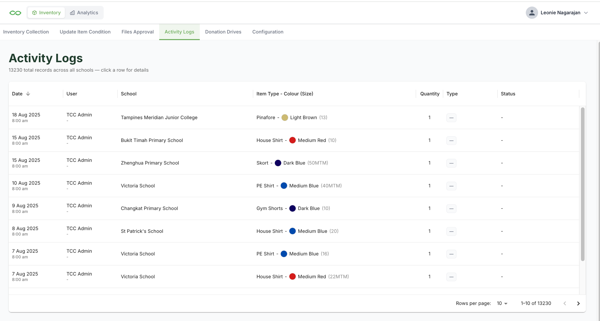

Comments Above is fine

---

48


### 3.3 Proposed User View Donation Drives

### School Dashboard Uniform Tracker Donation Drives Collaborations &


### Products User Name


### Donation Drives

### Resources and info materials to organise and manage donation drives


### Anglo Chinese School (Primary)

---

49

